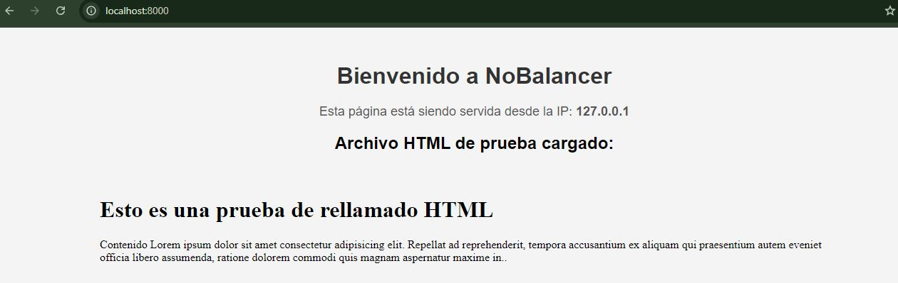

# NoBalancer

Este contenedor presenta un proyecto Nginx Server sin Balanceador, 
para correrlo se debe situar en la carpeta y ejecutar.

```bash
docker compose -f "Nginx/docker-composeNoBalancer.yml" up -d --build 
```
Este levanta una WEB en http://localhost:8000/

vista previa de imagen. 


para bajar este despliegue en docker se utiliza 

```bash
docker compose -f "Nginx/docker-composeNoBalancer.yml" down
```

# Balanceo de carga con Nginx

el balanceo de carga presenta varias caracteristicas para poder realizarlo. 

